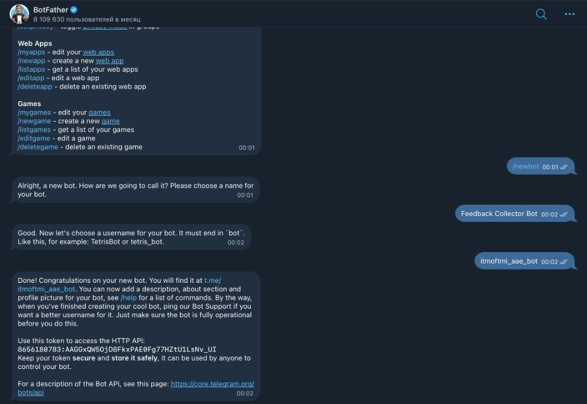
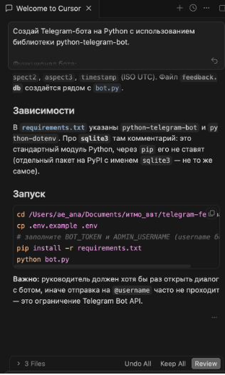
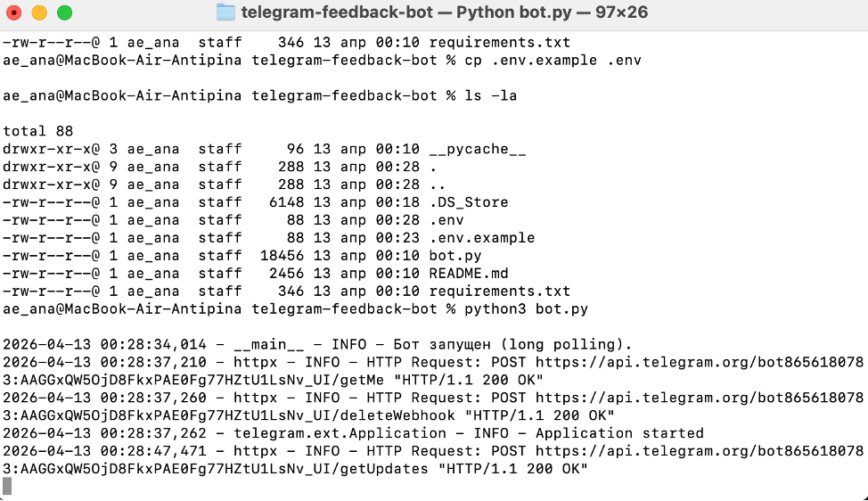
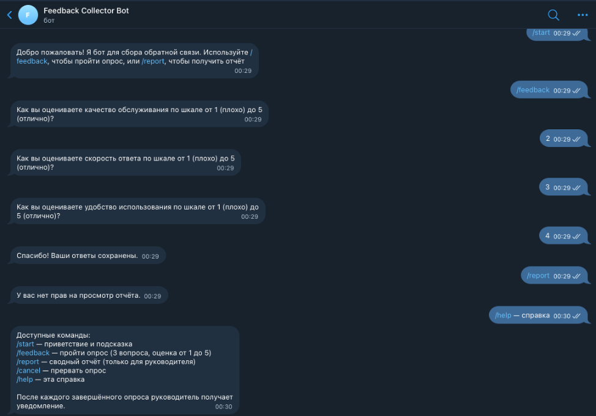

University: [ITMO University](https://itmo.ru/ru/)  
Faculty: [FICT](https://fict.itmo.ru)  
Course: [Vibe Coding: AI-боты для бизнеса](https://github.com/itmo-ict-faculty/vibe-coding-for-business)  
Year: 2025/2026  
Group: U4125  
Author: Antipina Anastasia Evgenievna  
Lab: Lab1  
Date of create: 10.04.2025  
Date of finished: 

# Отчёт по лабораторной работе **«Создание Telegram‑бота без программирования»**

### Шаг 1. Выбор задачи  
Выбран вариант: **Бот для сбора обратной связи**  

**Проблема, которую решает бот:**
* ручной сбор и обработка обратной связи от сотрудников занимает много времени;
* нет централизованного хранилища для ответов;
* сложно отслеживать динамику и статистику ответов;
* руководителю приходится напоминать команде о необходимости оставить отзыв.

**Почему выбрана эта задача:**
* высокая практическая ценность для любой организации;
* позволяет автоматизировать рутинный процесс;
* даёт возможность анализировать мнение сотрудников для улучшения работы;
* легко масштабируется под разные типы опросов.

### Шаг 2. Создание бота в Telegram  
1. Открыт диалог с `@BotFather` в Telegram.  
2. Выполнена команда `/newbot`.  
3. Присвоено имя: **Feedback Collector Bot**.  
4. Присвоен username: `itmoftmi_aae_bot` (где AB — мои инициалы).  
5. Получен токен и сохранён в безопасном месте).  

### Шаг 3. Составление промпта для LLM  
Использован Cursor с моделью GPT для генерации кода.  

**Промпт:**  
[Промт для Cursor](files/promt.md)

### Шаг 4. Генерация кода  
1. Промпт скопирован в Cursor.  
2. Получен сгенерированный код.  
3. Все файлы сохранены в папку проекта `telegram-feedback-bot`.  
4. Токен бота вставлен в файл `.env` как `BOT_TOKEN`.  

**Сгенерированные файлы:**  
* `bot.py` — основной код бота;  
* `requirements.txt` — список зависимостей;  
* `README.md` — инструкция по запуску;  
* `.env.example` — шаблон переменных окружения;  
* `bot_data.db` — SQLite‑база данных (создаётся автоматически).  

### Шаг 5. Запуск и тестирование  

Бот был запушен, все функции успешно выполняются.  
Видео с работой бота (включает в себя функционал первой и второй лабораторных работ):  

