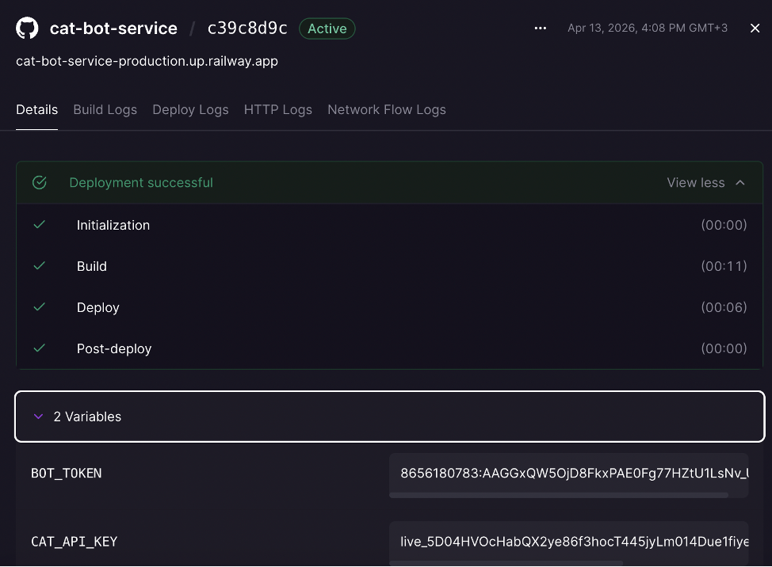
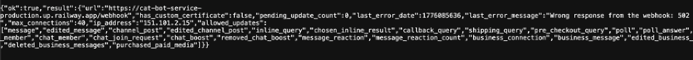
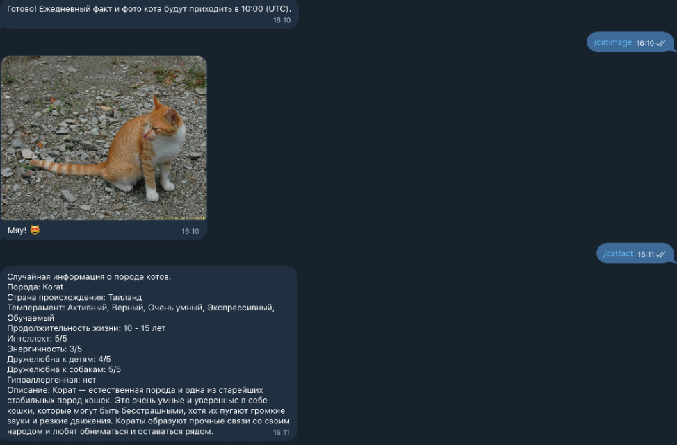

University: [ITMO University](https://itmo.ru/ru/)  
Faculty: [FICT](https://fict.itmo.ru)  
Course: [Vibe Coding: AI-боты для бизнеса](https://github.com/itmo-ict-faculty/vibe-coding-for-business)  
Year: 2025/2026  
Group: U4125  
Author: Antipina Anastasia Evgenievna  
Lab: Lab3
Date of create: 10.04.2025  
Date of finished: 

# Отчёт по лабораторной работе **«Запуск бота для реального использования»**  
## Шаг 1. Выбор способа деплоя  
Выбран Railway (облачный хостинг) как оптимальный вариант для постоянного использования с автоматическим перезапуском и простым интерфейсом.  

Обоснование выбора:  

* бесплатный тариф подходит для небольших ботов;  
* интеграция с GitHub упрощает деплой;  
* автоматический перезапуск после сбоев;  
* не требует постоянного включённого компьютера.  

## Шаг 2. Подготовка к деплою  
Выполненные действия:  

Проверка локального запуска: бот успешно протестирован на локальной машине, все команды (/start, /catfact, /catimage, /feedback, /report, /dailycat) работают корректно.  

Обработка ошибок: добавлена обработка сетевых ошибок, таймаутов и пустых ответов API.  

Хранение токена: токен бота перенесён в переменные окружения.  

Создан файл .env:  
```text  
env
BOT_TOKEN=ваш_токен_бота
CAT_API_KEY=ваш_ключ_The_Cat_API
```  
Создан .gitignore:
```text 
gitignore
.env
*.pyc
__pycache__/
*.db
*.log
```  
Создан requirements.txt:
```text 
txt
python-telegram-bot==20.7
python-dotenv==1.0.0
pandas==2.1.4
requests==2.31.0
```
Добавлено логирование:
```text 
python
import logging

logging.basicConfig(
    format='%(asctime)s - %(name)s - %(levelname)s - %(message)s',
    level=logging.INFO
)
logger = logging.getLogger(__name__)
```
## Шаг 3. Деплой на Railway  
Последовательность действий:  
* Регистрация на railway.app через GitHub.  

Создание нового проекта:  

* нажала «New Project»;  
* выбрала «Deploy from GitHub repo»;  
* подключила репозиторий с кодом бота.  

Настройка переменных окружения:  

* в настройках проекта добавила BOT_TOKEN и CAT_API_KEY;  
* вставила токены бота и API.  
  
Создание Procfile (в корне проекта):  

* worker: python bot.py
  
Запуск деплоя:

* Railway автоматически определил проект как Python;
* установил зависимости из requirements.txt;
* запустил бота через команду из Procfile.
<a>
  
</a>

Настройка webhook:  

* получила URL приложения: cat-bot-service-production.up.railway.app;  
* открыла в браузере:  
> (https://api.telegram.org/bot8656180783:AAGGxQW5OjD8FkxPAE0Fg77HZtU1LsNv_UI/getWebhookInfo)  
* убедилась, что получила ответ {"ok":true,...}.  
<a>  
  
</a>

## Шаг 4. Тестирование деплоя  

Проверила:  

* работу всех команд (/catfact, /catimage и т. д.);  
* стабильность работы;  
* отсутствие утечек памяти (мониторинг через логи Railway);  
* логирование запросов и ошибок.  

Результаты тестирования:  

* все команды работают корректно;  
* бот отвечает в течение 1–5 секунд;  
<a>  
  
</a>

## Шаг 5. Сбор обратной связи  

Действия:  

* Разослала ссылку на бота друзьям: @itmoftmi_aae_bot.  
* Создала Google‑форму для сбора фидбека с вопросами:
```text 
Что понравилось?  
Что не понравилось?  
Что можно улучшить?  
Хотели бы использовать такого бота регулярно?  
```
Результаты сбора фидбека (5 респондентов):  
* Понравилось: забавные факты, милые картинки, простота использования.  
* Не понравилось: не хватает поля /help в меню, нужно убрать из меню предназначенную для руководителя функцию /report.  

##  Шаг 6. Улучшения на основе фидбека

Для улучшения был использован следующий промт:  
```text 
В интерфейсе Telegram‑бота нужно скорректировать главное меню:  
Добавь команду /help — она должна отображаться в списке доступных команд. Текст подсказки для /help: «Показать справку по использованию бота».  
Исключи из главного меню команду /report. Эта функция имеет ограниченный доступ — она предназначена исключительно для руководителя проекта и не должна отображаться у остальных пользователей.  
Сохрани все остальные пункты меню без изменений.  
```

В результате:  
- добавлена кнопка «Помощь»   
- улучшена навигация.  

## Результаты лабораторной работы
✅ Бот успешно развёрнут на Railway и доступен 24/7.
✅ Собрана обратная связь от 5 реальных пользователей.
✅ Внесены улучшения на основе фидбека: кэширование, новая команда, оптимизация.
✅ Бот работает стабильно, без падений.
✅ Подготовлен отчёт с описанием всех этапов, скриншотами и результатами.
